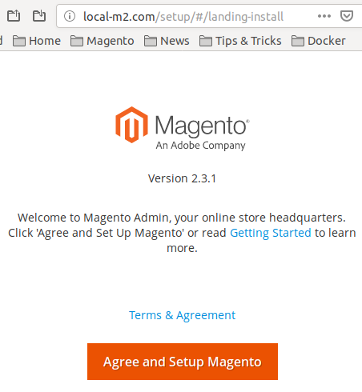
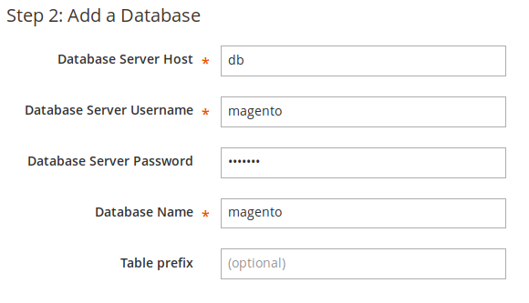

# Magento 2.3 Docker Image


## Table of Contents

* [Software versions](#versions)
* [Install Docker on Ubuntu 18.04](#installation)
* [Creating a new Magento project](#newproject)


## <a name="versions">Versions</a>

* Docker: 18.09.3
* Docker Compose: 1.23.0
* Magento: 2.3.1
* Apache: 2.4.25
* Php: 7.2.14
* Mariadb: 10.3.13
* Xdebug: 2.6.1
* Varnish: 4.1.10
* Redis: 5.0.4
* Elasticsearch: 5.6.14
* System: Debian GNU/Linux 9.6 (stretch)


### <a name="installation">Install Docker on Ubuntu 18.04</a>

Although we can install Docker and Docker Compose from the official Ubuntu repositories, they are several minor versions behind the latest release. So, we'll install Docker following the official documentation page (https://docs.docker.com/install/linux/docker-ce/ubuntu/).

#### Installation steps of Docker CE:

```
# Uninstall old versions
$ sudo apt-get remove docker docker-engine docker.io containerd runc

# Update the apt package index
$ sudo apt-get update

# Install packages to allow apt to use a repository over HTTPS:
$ sudo apt-get install \
    apt-transport-https \
    ca-certificates \
    curl \
    gnupg-agent \
    software-properties-common

# Add Docker’s official GPG key
$ curl -fsSL https://download.docker.com/linux/ubuntu/gpg | sudo apt-key add -

# Use the following command to set up the stable repository. 
$ sudo add-apt-repository \
   "deb [arch=amd64] https://download.docker.com/linux/ubuntu \
   $(lsb_release -cs) \
   stable"

# Update the apt package index.
$ sudo apt-get update

# Install the latest version of Docker CE and containerd
$ sudo apt-get install docker-ce docker-ce-cli containerd.io

```

#### Verify the installation

Verify that Docker CE is installed correctly by running the hello-world image.
    
`$ sudo docker run hello-world`
    
This command downloads a test image and runs it in a container. When the container runs, it prints an informational message and exits.

Now Docker CE is installed and running.

#### [Optional] Configure Docker to start on boot

Enable the docker system service to start docker when the system boots: 

`$ sudo systemctl enable docker`

To disable this behavior, use disable instead.

`$ sudo systemctl disable docker`

#### [Optional] Docker without sudo

By default, you need to use sudo to run Docker commands.

If you don’t want to use sudo when you use the docker command, create a Unix group called _docker_ and add users to it.

**Warning:**
The docker group is root-equivalent; see [Docker Daemon Attack Surface details](https://docs.docker.com/engine/security/security/#/docker-daemon-attack-surface) and this blogpost on [Why we don't let non-root users run Docker in CentOS, Fedora, or RHEL](https://www.projectatomic.io/blog/2015/08/why-we-dont-let-non-root-users-run-docker-in-centos-fedora-or-rhel/).

To create the docker group and add your user:

1- Add the docker group if it doesn't already exist

`$ sudo groupadd docker`

2- Add your user to the docker group.

`$ sudo usermod -aG docker $USER`

Other optional configuration steps: (https://docs.docker.com/install/linux/linux-postinstall/)
 

### <a name="installation">Install Docker Compose</a>

In order to manage and execute docker-compose files we need to install the Docker Compose package.

The command below is slightly different than the one you'll find on the Releases page. By using the -o flag to specify the output file first rather than redirecting the output, this syntax avoids running into a permission denied error caused when using sudo.

Go to https://docs.docker.com/release-notes/docker-compose/ and look for the last release of docker-compose.

We'll check the current release and if necessary, update it in the command below:

```
$ sudo curl -L https://github.com/docker/compose/releases/download/1.23.0/docker-compose-`uname -s`-`uname -m` -o /usr/local/bin/docker-compose
```

Next we'll set the permissions:

`sudo chmod +x /usr/local/bin/docker-compose`

Then we'll verify that the installation was successful by checking the version:

`docker-compose --version`

This will print out the version we installed:

```
Output
docker-compose version 1.23.0, build a133471
```

## Creating a new Magento project

### <a name="newproject">Set up Apache-php and Mysql containers</a>

1. Create the following folder structure in our workspace folder.
  
   ```
   # Recommended path: ~/workspace/{project_name}/
   - data                  // mysql data, apache log files...
     |-- apache
     |-- elasticsearch
     |-- mysql
     |-- redis
   - docker                // Our magento2 docker project
   - src                   // Magento 2 source code
   ```
   ```bash
   $ mkdir -p data/apache data/elasticsearch data/mysql data/redis docker src
   ```
       
2. Clone the Docker project

    `$ git clone git@github.com:jcastellanos926/magento2-docker.git docker`
    
3. Create the .env file from .env.sample and configure it.

    ```bash
    $ cp .env.sample .env
    $ gedit .env
    ```
    
4. Go to the docker folder and execute: 

    ```bash
    $ docker-compose build
    $ docker-compose up -d
    ```
  
5. Install Magento 2 using composer.

    ```bash
    $ docker exec -it web bash
    $ composer create-project --repository=https://repo.magento.com/ magento/project-community-edition .
    ```
        
    [More Info](https://devdocs.magento.com/guides/v2.3/install-gde/composer.html)   
    
6. Change apache user as the file owner of our files and set the right permissions following the official [Magento documentation](https://devdocs.magento.com/guides/v2.3/install-gde/prereq/file-system-perms.html)

    ```bash
    $ docker exec -it web bash
    $ chown -R www-data:www-data .
    $ find var generated vendor pub/static pub/media app/etc -type f -exec chmod u+w {} +
    $ find var generated vendor pub/static pub/media app/etc -type d -exec chmod u+w {} +
    $ chmod u+x bin/magento
    ```

7. Edit the /etc/hosts file in your local machine to point your custom domain names to localhost

    ```bash
    # Magento 2 project
    127.0.0.1 local-m2.com
    127.0.0.1 db
    ```

8. Open your browser and go to your configured localhost domain


9. Follow the installation wizard. Use the previously configured database credentials.

